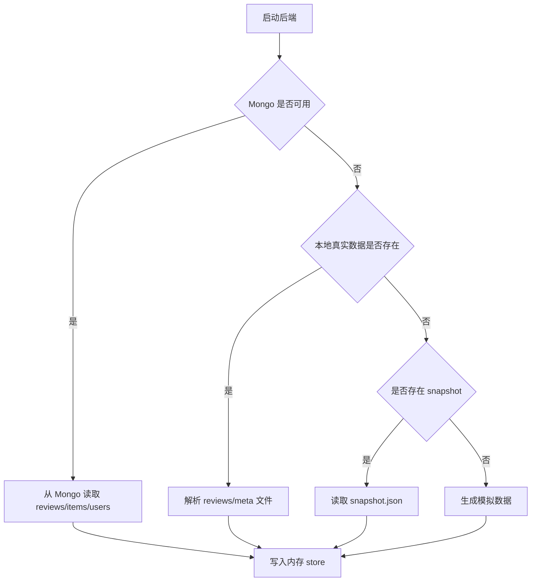
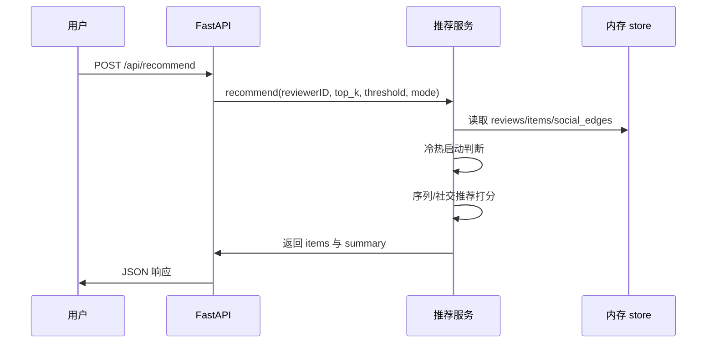

# uni-rec 技术文档

## 项目概述
uni-rec 提供一套可运行的推荐系统演示环境：后端负责数据加载、推荐与指标统计；前端负责推荐结果和过程的可视化展示。项目面向 Amazon Electronics 数据字段对齐与展示需求，支持从 MongoDB 或本地数据文件读取。

## 项目目录结构
```text
uni-rec/
├─ backend/
│  ├─ app/
│  │  ├─ core/
│  │  │  ├─ config.py
│  │  │  └─ llm.py
│  │  ├─ models/
│  │  │  └─ schemas.py
│  │  ├─ routes/
│  │  │  └─ api.py
│  │  ├─ services/
│  │  │  ├─ data_generator.py
│  │  │  ├─ data_store.py
│  │  │  ├─ feedback.py
│  │  │  ├─ metrics.py
│  │  │  ├─ preprocess.py
│  │  │  └─ recommendation.py
│  │  └─ main.py
│  ├─ data/
│  │  └─ snapshot.json
│  ├─ scripts/
│  │  └─ import_amazon_mongo.py
│  ├─ requirements.txt
│  └─ pyproject.toml
├─ frontend/
│  ├─ src/
│  │  ├─ components/
│  │  ├─ api.ts
│  │  ├─ App.tsx
│  │  └─ main.tsx
│  ├─ package.json
│  └─ vite.config.ts
├─ docs/
│  └─ images/
├─ README.md
└─ DOCUMENTATION.md
```

## 关键配置项
| 配置项 | 说明 | 默认值 | 作用范围 |
| --- | --- | --- | --- |
| MODELSCOPE_API_KEY | ModelScope API Key | 空 | LLM 推荐理由 |
| MODELSCOPE_API_BASE | ModelScope API 地址 | https://api-inference.modelscope.cn/v1/chat/completions | LLM 推荐理由 |
| MODELSCOPE_MODEL | 模型名称 | Qwen/Qwen2.5-7B-Instruct | LLM 推荐理由 |
| DATA_DIR | 数据目录 | backend/data | 本地快照与原始数据 |
| REVIEWS_FILE | reviews 文件路径 | backend/data/reviews_Electronics.json.gz | 真实数据加载 |
| METADATA_FILE | metadata 文件路径 | backend/data/meta_Electronics.json.gz | 真实数据加载 |
| MAX_REVIEWS | reviews 采样上限 | 5000 | 真实数据加载 |
| MAX_ITEMS | items 采样上限 | 2000 | 真实数据加载 |
| MAX_USERS | users 采样上限 | 2000 | 真实数据加载 |
| SOCIAL_DEGREE | 社交边采样度 | 3 | 真实数据加载 |
| MONGO_URI | MongoDB 连接 | 空 | Mongo 数据读取 |
| MONGO_DB | MongoDB 数据库 | uni_rec | Mongo 数据读取 |
| MONGO_REVIEWS_COLLECTION | reviews 集合名 | electronics_reviews | Mongo 数据读取 |
| MONGO_ITEMS_COLLECTION | items 集合名 | electronics_items | Mongo 数据读取 |
| MONGO_USERS_COLLECTION | users 集合名 | electronics_users | Mongo 数据读取 |

## 功能模块说明
**数据加载与存储**
- 说明：初始化顺序为 MongoDB → 本地真实数据 → snapshot → 模拟数据，统一写入内存 store 供推荐与指标访问
- 入口：`init_store()` [data_store.py](file:///Users/bytedance/Desktop/personal/uni-rec/backend/app/services/data_store.py#L303-L322)
- 示例代码：
```python
from app.services.data_store import init_store, store

init_store()
print(len(store["users"]), len(store["items"]))
```

**推荐服务**
- 说明：冷启动使用社交推荐，热启动使用序列推荐；可选 LLM 统一生成推荐理由
- 入口：`recommend()` [recommendation.py](file:///Users/bytedance/Desktop/personal/uni-rec/backend/app/services/recommendation.py#L95-L124)
- 示例代码：
```python
from app.services.recommendation import recommend

result = await recommend(
    reviewer_id="A1234567",
    top_k=10,
    threshold=5,
    mode="auto",
    use_llm=False,
)
print(result["items"][0]["meta"]["title"])
```

**预处理与偏好计算**
- 说明：从 reviews 计算用户序列、热度与类目偏好
- 入口：`compute_category_preferences()` [preprocess.py](file:///Users/bytedance/Desktop/personal/uni-rec/backend/app/services/preprocess.py#L27-L39)
- 示例代码：
```python
from app.services.preprocess import build_user_review_map, compute_category_preferences
from app.services.data_store import store

user_map = build_user_review_map(store["reviews"])
events = user_map.get("A1234567", [])
prefs = compute_category_preferences(events, store["items"])
print(prefs)
```

**反馈与指标**
- 说明：记录反馈并计算 CTR、覆盖率、多样性
- 入口：`add_feedback()` 与 `compute_metrics()` [feedback.py](file:///Users/bytedance/Desktop/personal/uni-rec/backend/app/services/feedback.py#L1-L9) [metrics.py](file:///Users/bytedance/Desktop/personal/uni-rec/backend/app/services/metrics.py#L7-L25)
- 示例代码：
```python
from app.services.feedback import add_feedback
from app.services.metrics import compute_metrics

add_feedback("A1234567", "B0000001", "like")
print(compute_metrics())
```

**前端展示**
- 说明：统一调用后端接口获取推荐与指标并渲染
- 入口：`requestRecommend()` [api.ts](file:///Users/bytedance/Desktop/personal/uni-rec/frontend/src/api.ts#L8-L36)
- 示例代码：
```ts
import { requestRecommend } from "@/api"

const res = await requestRecommend({
  reviewerID: "A1234567",
  top_k: 10,
  threshold: 5,
  mode: "auto",
  use_llm: true
})
```

## 关键业务流程
**数据初始化流程（Mermaid）**


**推荐流程时序图（Mermaid）**


## 接口文档
**注释提取说明**
- 未检测到包含 @param/@return 的代码注释，API 文档基于路由与模型定义自动整理

**API 清单**
| 方法 | 路径 | 说明 | 请求体/参数 | 响应 |
| --- | --- | --- | --- | --- |
| GET | /api/health | 健康检查 | 无 | `{ "status": "ok" }` |
| POST | /api/data/generate | 生成模拟数据 | DataGenerateRequest | DataSnapshotResponse |
| GET | /api/users/{reviewerID} | 用户资料 | 路径参数 reviewerID | UserProfileResponse |
| GET | /api/users/{reviewerID}/startup-type | 冷热启动 | query: threshold | StartupTypeResponse |
| GET | /api/users/{reviewerID}/sequence | 序列事件 | 无 | SequenceResponse |
| GET | /api/users/{reviewerID}/social-graph | 社交图 | 无 | SocialGraphResponse |
| POST | /api/recommend | 获取推荐 | RecommendRequest | RecommendResponse |
| POST | /api/feedback | 反馈记录 | FeedbackRequest | `{ ok, record }` |
| GET | /api/metrics | 指标统计 | 无 | MetricsResponse |

**请求与响应示例**
```bash
curl -X POST "http://localhost:8000/api/recommend" \
  -H "Content-Type: application/json" \
  -d '{
    "reviewerID": "A1234567",
    "top_k": 10,
    "threshold": 5,
    "mode": "auto",
    "use_llm": false
  }'
```

```json
{
  "reviewerID": "A1234567",
  "startup_type": "hot",
  "module": "sequence",
  "items": [
    {
      "asin": "B0000001",
      "score": 1.23,
      "reason": "基于近期行为序列与内容偏好推荐",
      "source": "sequence",
      "meta": {
        "asin": "B0000001",
        "title": "Example Item",
        "categories": [["Electronics", "Audio", "Headphones"]]
      }
    }
  ],
  "summary": "热启动用户使用序列推荐"
}
```

## 部署指南
**后端部署**
```bash
cd backend
uv venv
uv pip install -r requirements.txt
MONGO_URI="mongodb://localhost:27017" \
MONGO_DB="uni_rec" \
uvicorn app.main:app --host 0.0.0.0 --port 8000
```

**前端部署**
```bash
cd frontend
pnpm install
pnpm build
pnpm preview
```

## 数据导入脚本
**MongoDB 导入**
- 脚本路径：`backend/scripts/import_amazon_mongo.py`
- 导入后自动建立 reviewerID 索引（reviews 与 users 集合）
```bash
MONGO_URI="mongodb://localhost:27017" \
MONGO_DB="uni_rec" \
REVIEWS_FILE="backend/data/reviews_Electronics.json.gz" \
METADATA_FILE="backend/data/meta_Electronics.json.gz" \
MAX_REVIEWS=5000 MAX_ITEMS=2000 MAX_USERS=2000 \
python3 backend/scripts/import_amazon_mongo.py
```
